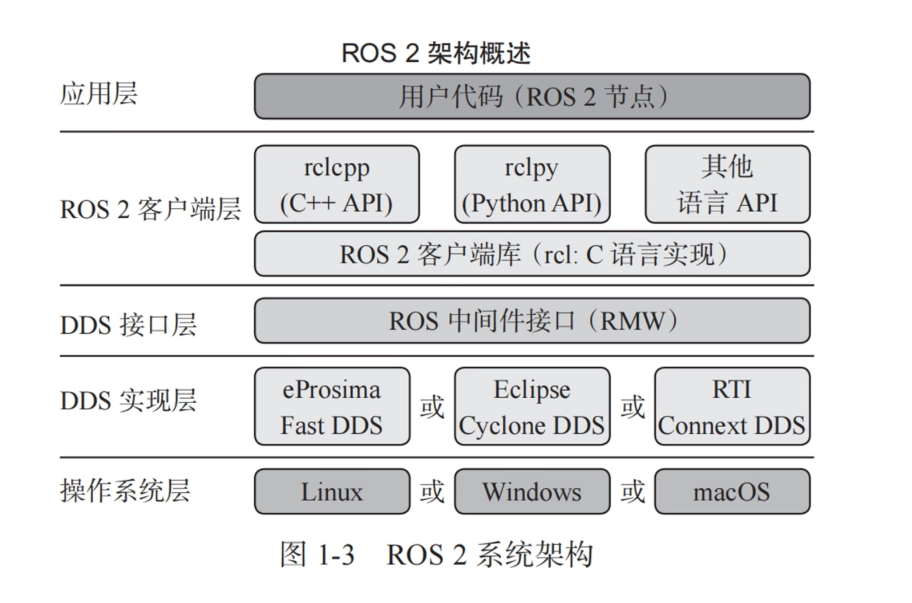
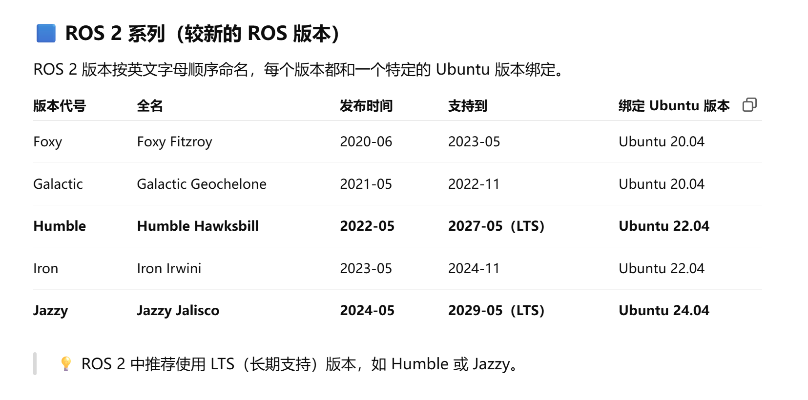
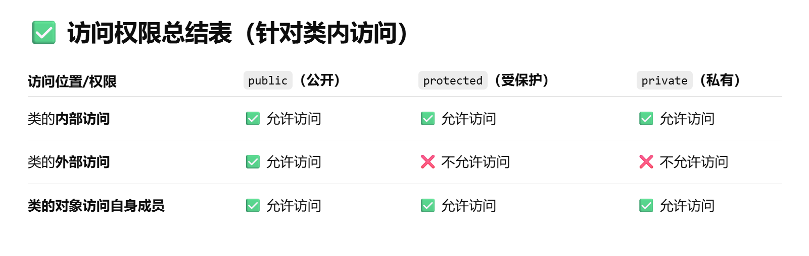
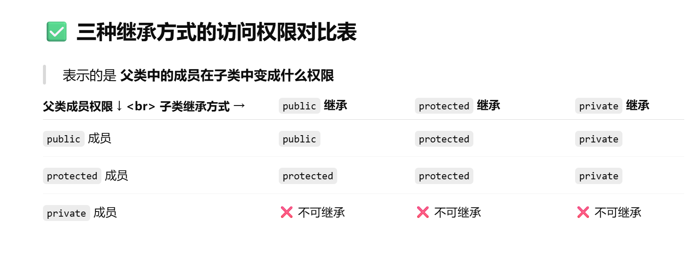
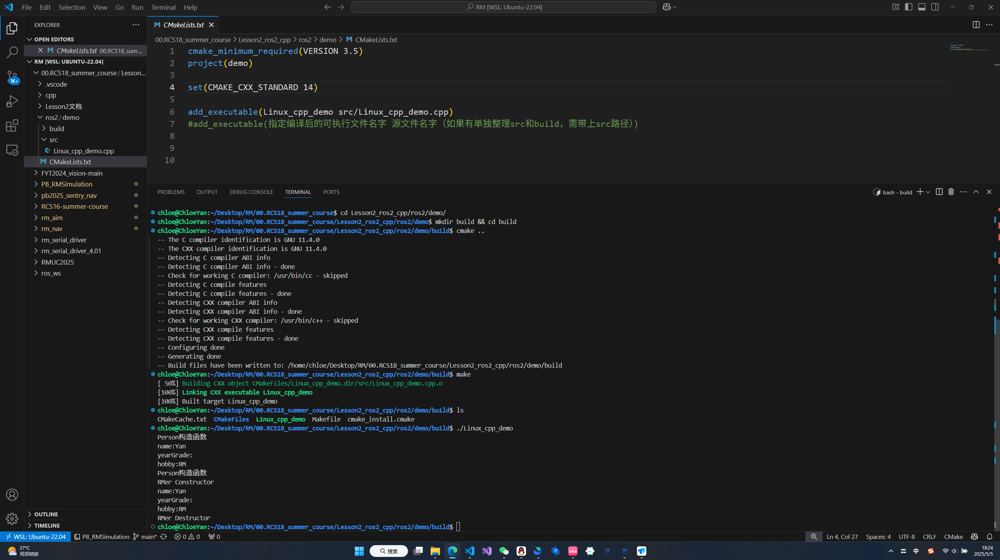
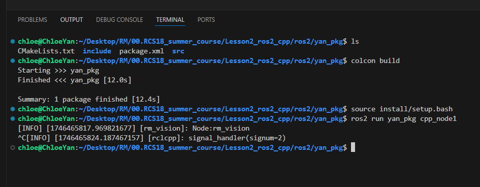
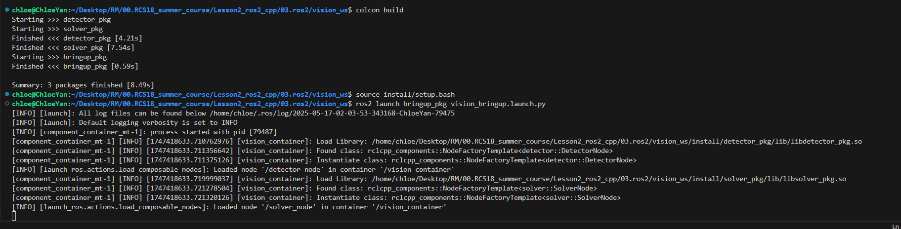
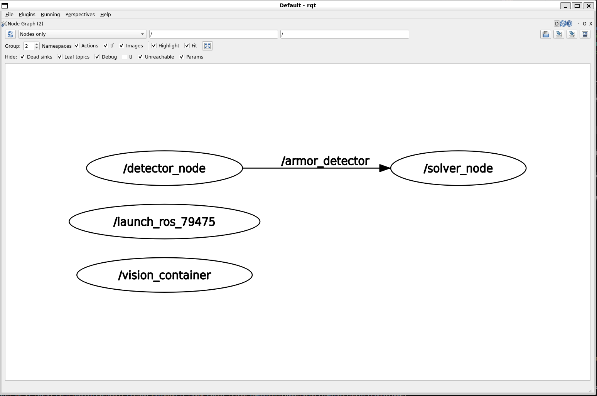
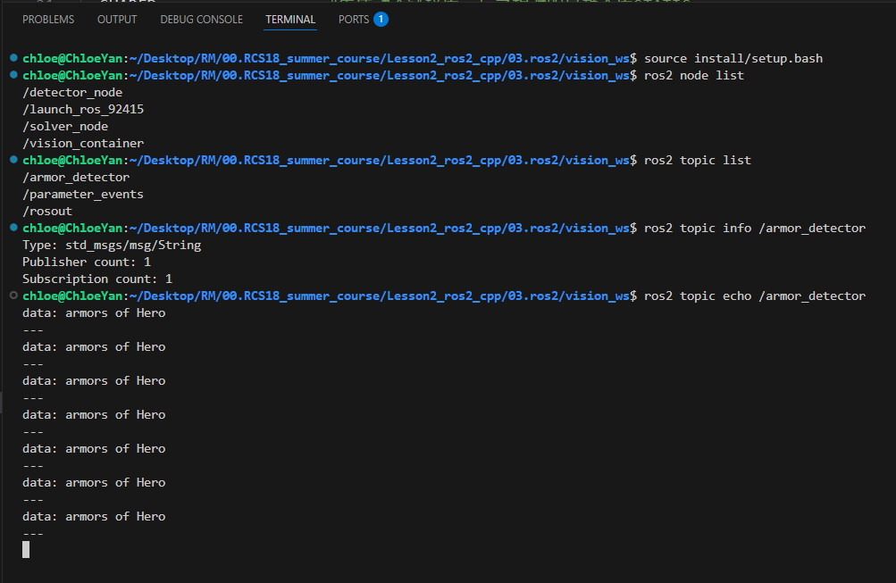

# 第2讲 ros2与C++

## 0.自学资料及连接
b站：  
鱼香ros   
【《ROS 2机器人开发从入门到实践》课程介绍】https://www.bilibili.com/video/BV1GW42197Ck?vd_source=7f8884af7fd7d142a4a56a0e52735937  
黑马程序员C++   
【黑马程序员匠心之作|C++教程从0到1入门编程,学习编程不再难】https://www.bilibili.com/video/BV1et411b73Z?vd_source=7f8884af7fd7d142a4a56a0e52735937  

社区：  
鱼香ROS社区  
https://fishros.org.cn/forum/topic/20/%E5%B0%8F%E9%B1%BC%E7%9A%84%E4%B8%80%E9%94%AE%E5%AE%89%E8%A3%85%E7%B3%BB%E5%88%97

GitHub：  
RCS17培训资料在（知识体系很完整）   
https://github.com/XMURCSVision/tutorial.git


## 1.了解ros2
**Robot Operating System 2**
并非操作系统，依赖于Linux
  
**22.04 humble**
  
完整的讲解请移步小鱼的课程

## 2.C++面向对象编程
把C++放在这个位置是为了ros2服务，只讲解会用得上的部分、和C不一样的部分，cpp的完整体系学习需要大家自学（其实用不上完整的cpp体系，会使用的部分培训中一定会交，剩下的看个人学习需求了


### **(1)基本了解类和对象**  
成员函数、成员变量  
构造函数、析构函数  
命名习惯、this   


```C++
//目标：了解类和对象
//文件路径：cpp/c1_class_public.cpp 以及 c2_class_private.cpp

#include <iostream>
#include <string>
using namespace std;

class Person
{
public:
    Person()
    {
        std::cout << "Person Constructor" << endl;
    }
    ~Person()
    {
        cout << "Person Destructor" << endl;
    }

    void PrintInfo()
    {
        cout << "name:" << this->m_name << endl;
        cout << "yearGrade:" << this->m_gradeYear << endl;
        cout << "hobby:" << this->m_hobby << endl;
    }

    int m_num;
    string m_name;
    string m_gradeYear;
    string m_hobby;
};

int main()
{
    Person p1;

    p1.m_num=10;
    p1.m_name = "Yan";
    p1.m_gradeYear = "24";
    p1.m_hobby = "RM";

    p1.PrintInfo();
    return 0;
}

```


### **(2)继承**  
父类Base class、子类Derived class   
public、protected、private 

```C++
// 目标：学会public继承
// 文件路径：cpp/c3_inheritance.cpp

#include <iostream>
#include <string>
using namespace std;

class Person
{
public:
    Person(string name, int yearGrade, string hobby)
    {
        cout << "Person构造函数" << endl;
        this->m_name = name;
        this->m_gradeYear = yearGrade;
        this->m_hobby = hobby;
    }

    void PrintInfo_Person()
    {
        cout << "name:" << this->m_name << endl;
        cout << "yearGrade:" << this->m_gradeYear << endl;
        cout << "hobby:" << this->m_hobby << endl;
    }

    // protected
    // 目前视觉代码里没有用上protected，暂时不讲

    string m_name;
    string m_gradeYear;
    string m_hobby;
};

class RMer : public Person
{
public:
    RMer(string name, int yearGrade, string hobby, string group)
        : Person(name, yearGrade, hobby) // 调用父类的构造函数
    {
        this->m_group = group;
        cout << "RMer Constructor" << endl;
    }
    ~RMer()
    {
        cout << "RMer Destructor" << endl;
    }

    void PrintInfo_RMer()
    {
        PrintInfo_Person();
        cout << "group:" << this->m_group << endl;
    }

private:
    string m_group;
};

int main()
{
    Person p1("Yan", 24, "RM");
    p1.PrintInfo_Person();

    RMer rm1("Yan", 24, "RM", "Vision");
    rm1.PrintInfo_Person();

    return 0;
}
```

## 3.ros2与rclcpp
### (a)安装ros2
小鱼一键安装
```bash
wget http://fishros.com/install -O fishros && . fishros
```
【《ROS 2机器人开发从入门到实践》1.2.4 在Ubuntu中安装ROS2】https://www.bilibili.com/video/BV1Jz421B7Ey?vd_source=7f8884af7fd7d142a4a56a0e52735937


### (b)cpp_demo
cmake工具：安装ros2时已自动安装CMake
```bash
mkdir build
cd build
cmake ..     # 用 CMakeLists.txt 生成 Makefile
make         # 用 Makefile 编译 demo.cpp
ls           # 会看到 demo 可执行文件
./demo       # 运行你的程序
```

提醒：  
1.不要在源码目录直接 ``make``，始终用 ``build/`` 目录编译  
2.如果报错找不到 ``CMakeLists.txt``，检查是否在 ``build/`` 中执行 ``cmake ..``  
3.cmake只是体验，不要在这个环节纠结CMakeLists.txt，只记住add_executable，最后会有总结，现在先学会抄    


### (c)pkg
#### (1)create pkg
```bash
ros2 pkg create <your_package_name> --build-type ament_cmake --license Apache-2.0
#把整个<your_package_name>换成你的包名，其他直接原文复制
# ament_python
```
```bash
#例如
ros2 pkg create yan_pkg --build-type ament_cmake --license Apache-2.0
```
```
my_robot_pkg/                 ← 你的包目录
├── CMakeLists.txt           ← 编译配置文件（用 CMake 编写）
├── package.xml              ← 包描述信息（名字、依赖、许可证等）
├── include/                 ← 头文件目录（如有的话）
│   └── my_robot_pkg/        ← 推荐同名子目录，放 .hpp 头文件
├── src/                     ← 源码目录（C++ 文件通常放这里）
│   └── main.cpp             ← 示例源码（需手动添加）
├── launch/                  ← 启动文件目录（.py/.xml 启动器）
│   └── demo.launch.py       ← 示例启动文件（需手动添加）
├── config/                  ← 参数配置文件目录
│   └── params.yaml          ← 示例参数文件（需手动添加）
├── rviz/                    ← RViz 可视化配置目录
│   └── view.rviz            ← RViz 场景（需手动添加）
└── README.md                ← 说明文档（可选）
```

#### (2)编写你的第一个Node
``#include "rclcpp/rclcpp.hpp"`` 报错：详见vscode报错配置文档  

分文件编写：先全部合在cpp写，最后再分到hpp  

```C++
//这是include/yan_pkg/cpp_node1.hpp
#include <iostream>
#include <string>
#include "rclcpp/rclcpp.hpp"
using namespace std;
class MyNode : public rclcpp::Node
{
public:
    MyNode(string node_name) : Node(node_name) // 设置节点名字
    {
        RCLCPP_INFO(this->get_logger(), "Node:rm_vision");
    }
};

```
```C++
//这是src/cpp_node1.cpp
#include "yan_pkg/cpp_node1.hpp"

int main(int argc, char *argv[]) // 这个传参当做默认就行
{
    rclcpp::init(argc, argv); // 初始化ROS 2
    auto node1 = std::make_shared<MyNode>("rm_vision");
    rclcpp::spin(node1); // 启动节点node2
    rclcpp::shutdown();  // 清理
    return 0;
}
```

ament介绍：是ros2中的构建系统（build system），用于管理build、lib、install  
ament作用：找到你的依赖（如 rclcpp, std_msgs）、自动生成安装路径、让 colcon build 能正常工作  

CMakeLists.txt  
```cmake
#这里只展示了我们要添加的部分，其余保留自带的内容  

# 我们的node1
find_package(rclcpp REQUIRED)

# 添加可执行程序
add_executable(cpp_node1 src/cpp_node1.cpp)

# hpp搜索路径，一定要放在add_executable后面
target_include_directories(cpp_node1
  PRIVATE
    ${CMAKE_CURRENT_SOURCE_DIR}/include
)

# 链接依赖项，即绑定executable和rclcpp
ament_target_dependencies(cpp_node1 rclcpp) 

# 安装可执行文件
install(TARGETS
  cpp_node1
  DESTINATION lib/${PROJECT_NAME}
)
```

package.xml
```xml
  <!-- 这里只展示了我们要添的部分 -->
  <!-- 在运行时的依赖库，这里我们只用到了rclcpp -->
  <!-- 目前只有这一行是我们自己添的，其他都是create pkg自动生成的 -->
  <depend>rclcpp</depend> <!-- ROS 2 C++ 客户端库 -->
```

安装colcon编译工具  
```bash
sudo apt update #更新软件包列表
sudo apt install python3-colcon-common-extensions #安装
```

开始编译  
首先确认，当前工作路径是你的pkg，如果不是，先cd（比如我这里是yan_pkg）
```bash
colcon build 
```
编译通过后，先source（后续讲，先记住）
```bash
source install/setup.bash
```
```bash
ros2 run <your_package_name> <your_executable>
#例如
ros2 run yan_pkg cpp_node1
```
ctrl+c 结束进程  
P.S.技巧：Tab补全  



### (d)workspace
理解workspace和package：  
举例：
```
rm_auto_aim_ws/                 ← 总 workspace（项目根目录）
├── src/                        ← 源码目录，存放各个 ROS 2 包（每个pkg里都有自己的 include、src目录，以及package.xml 和 CMakeLists.txt）
│   ├── rm_serial_driver_pkg/   ← 串口驱动包
│   ├── armor_detector_pkg/     ← 装甲板检测包
│   └── armor_solver_pkg/       ← 自动瞄准求解包
├── build/                      ← 🔧 构建中间产物（每个包一个子目录）
│   ├── rm_serial_driver_pkg/
│   ├── armor_detector_pkg/
│   └── armor_solver_pkg/
├── install/                    ← ✅ 构建完成后的可执行环境（source 的 setup.bash 就在这）
│   ├── setup.bash
├── log/                        ← 📝 构建日志目录（失败信息、警告都会在这）

```
指令创建ws，在src下创建pkg  
```bash
mkdir -p yan_ws/src 
ros2 pkg create detector_pkg --build-type ament_cmake --license Apache-2.0 
ros2 pkg create solver_pkg --build-type ament_cmake --license Apache-2.0  
# launch_pkg我们只需要极简版本，手动创建文件夹就行
```

pkg作为组件，不写main函数，则需要component_container来加载，以下将详细介绍  

#### (1)话题、发布者、订阅者


1. hpp和cpp份文件编写：新知识 define 和 namespace  
以下是通用模板示例  
```C++
// node_1.hpp文件
#ifndef DETECTOR_NODE_HPP // if not define
#define DETECTOR_NODE_HPP // define
namespace detector
{
    class DetectorNode : public rclcpp::Node
    {
        // 正常的成员函数、成员变量声明
        explicit DetectorNode(const rclcpp::NodeOptions & options); 
    };
} //detector
#endif //DETECTOR_NODE_HPP // 这和前面的define是对应的
```
```C++
// node_1.cpp文件
#include "detector_pkg/detector_node.hpp"
namespace detector
{
    // 然后就是正常的函数实现
    DetectorNode::DetectorNode(const rclcpp::NodeOptions & options)
    : rclcpp::Node("detector_node", options){}

}
#include "rclcpp_components/register_node_macro.hpp"    // 这一行宏定义没有要求位置，但是习惯上也是放结尾
RCLCPP_COMPONENTS_REGISTER_NODE(detector::DetectorNode) // 这行宏必须放在.cpp文件的最后一行
                // 括号内填的是(namespace::ClassName)
```

NodeOptions详解  
- ``const & options`` 
    - const防止修改
    - &传本体，不复制，只读
- ``: rclcpp::Node()``
    - 调用父类构造函数
- ``"detector_node"``
    - 设置节点名字
- ``options``
    - 把传进来的配置继续传给父类

2. 消息（一种封装好的结构体，有ros2的标准消息，也可自定义）    
- ros2消息类型有官方文档，但是没必要抱着啃    
- 真正的步骤是，看到了一个不熟悉的消息类型，把它复制到搜索栏，找官方文档看  
    - 比如找一个``std_msgs/msg/String``
    - 再比如``geometry_msgs/PoseStamped``   
- 消息、字段、数据类型  

3. 创建发布者 
以下仅是通用模版示范，只摘取关键的部分，完整写法见vision_ws    
```C++
// 创建发布者，发布内容，习惯在构造函数里create
detector_pub_=this->create_publisher<std_msgs::msg::String>("/armor_detector",10);
pubDetector(); // 依据需要调用函数，一般这个函数里会集成要发布的内容，并且执行publish操作
```
```C++
// pubDetector函数，是放在类里的
void pubDetector()
{
    auto msg = std_msgs::msg::String(); // 拓展：auto自动类型推导
    msg.data = "hello"; // 消息内容赋值
    publisher_->publish(msg); // Node的publish函数
}
```

4. 创建订阅者  
重点是回调函数！
```C++
// 订阅者示例
solver_subscription_ = this->create_subscription<std_msgs::msg::String>(
            "/armor_detector", 10,                                                // 话题名和队列长度
            std::bind(&SolverNode::topic_callback, this, std::placeholders::_1)); // 绑定回调函数
```
回调函数逐一解析：  
- ``std::bind()``
    - 绑定 
    - 函数原型为 ``std::bind(函数名, 参数1, 参数2, ...)``，返回值是一个函数对象
- ``&ClassName::callback_func``
    - 指定要绑定的成员函数
    - 必须使用``&``，这是成员函数的地址，而非直接调用成员函数 
- ``this``
    - 告诉``std::bind``，将来调用时，使用当前这实例（也就是当前的节点）来调用``topic_callback``
- ``std::placeholders::_1``
    - 占位符
    - ros2的``create_subscription()``默认要求回调函数接受一个参数（消息类型的SharedPtr，比如std_msgs::msg::String型的SharedPtr）
    - ``_1``表示，函数将来会接收到一个参数，并且要把它赋值给``topic_callback``的第一个参数
    - 如果topic_callback要求两个或者更多的参数，那么bind可以写``_1,_2``，通常1个msg就够了

其实还有lambda表达式的版本，预计放在暑假讲

5. CMakeLists.txt 和 package.xml   
学习要求：会抄、会拷打ai（得懂一点才会拷打，不然会被ai的思路牵走）  
很大的不同在于，这两个pkg都没有main函数，而是使用rclcpp_components组件，搭配launch来启动节点   
详见具体代码  

6. launch_pkg   
学习要求：会抄、会拷打ai  
launch的文件目录很简单，所以选择手动创建
```tree
.
├── CMakeLists.txt
├── launch
│   └── vision_bringup.launch.py
└── package.xml
```    
由于py是用于启动节点（C++），于是需要cmake来编译这些源码，所以py的包缺需要cmakelist    
刚刚两个节点注册成了components，在launch中会体现   
```python
#vision_bringup.launch.py 关键部分截取
#只有composableNode是自己添加，其他直接照搬模版
 ComposableNode(
                package='detector_pkg',             # pkg名
                plugin='detector::DetectorNode',    # namespace::ClassName
                name='detector_node'                # NodeName
            )
```
cmake和xml直接copy，这不是launch的重点  
```xml
<?xml version="1.0"?>
<?xml-model href="http://download.ros.org/schema/package_format3.xsd" schematypens="http://www.w3.org/2001/XMLSchema"?>
<package format="3">
  <name>bringup_pkg</name> <!-- 包名记得改 -->
  <version>0.0.0</version>
  <description>TODO: Package description</description>
    <maintainer email="chloe@outlook.com">chloe</maintainer> <!-- maintainer是必要的，填自己 -->
  <license>MIT</license>

  <buildtool_depend>ament_cmake</buildtool_depend>

  <!-- 这里的depend真正作用是指定编译顺序，由依赖关系指定编译顺序 -->
  <depend>detector_pkg</depend>
  <depend>solver_pkg</depend>


  <export>
    <build_type>ament_cmake</build_type>
  </export>
</package>

```
```cmake
cmake_minimum_required(VERSION 3.8)
project(bringup_pkg) # project_name记得改

find_package(ament_cmake_auto REQUIRED)

if(BUILD_TESTING)
  find_package(ament_lint_auto REQUIRED)
  set(ament_cmake_copyright_FOUND TRUE)
  ament_lint_auto_find_test_dependencies()
endif()

ament_auto_package( # 这是一个高级宏封装
  INSTALL_TO_SHARE
  launch
)
```


7. 最终运行：把节点launch起来   
编译（注意目录！！！）、source、ros2 launch     
对比，``ros2 run <executable>``   
``ros2 launch <launch_pkg> filename.launch.py`` 
```bash
colcon build 
source install/setup.bash
ros2 launch bringup_pkg vision_bringup.launch.py
```



8. 开rqt查看  
rqt是自带的一款动态调参工具  


9. list 和 echo
```bash
source install/setup.bash
ros2 node list
ros2 topic list
ros2 topic info /armor_detector
ros2 topic echo /armor_detector
```



### (e)CMakeLists.txt
对于不同的情况，cmakelist的写法也不完全相同，以下将对比我们刚刚写过的3种cmakelist  
demo版本  
```bash
cmake_minimum_required(VERSION 3.5) # cmake最低版本

project(demo) # project_name

add_executable(Linux_cpp_demo src/Linux_cpp_demo.cpp)  # executable
#add_executable(指定编译后的可执行文件名字 源文件名字（如果有单独整理src和build，需带上src路径）) 
```
单个pkg，有main函数版本
```cmake
cmake_minimum_required(VERSION 3.8)
project(yan_pkg) # 这是ros2 create时自动生成的

if(CMAKE_COMPILER_IS_GNUCXX OR CMAKE_CXX_COMPILER_ID MATCHES "Clang")
  add_compile_options(-Wall -Wextra -Wpedantic)
endif()

# find_package 寻找第三方库
find_package(ament_cmake REQUIRED) # 这是必要的，也是create时--build-type ament_cmake自动生成的
find_package(rclcpp REQUIRED)

# 添加可执行程序
add_executable(cpp_node1 src/cpp_node1.cpp)

# hpp搜索路径，一定要放在add_executable后面
target_include_directories(cpp_node1
  PRIVATE
    ${CMAKE_CURRENT_SOURCE_DIR}/include
)

# 链接依赖项，即绑定executable和rclcpp
ament_target_dependencies(cpp_node1 rclcpp) 

# 安装可执行文件
install(TARGETS
  cpp_node1
  DESTINATION lib/${PROJECT_NAME}
)

if(BUILD_TESTING)
  find_package(ament_lint_auto REQUIRED)
  set(ament_cmake_copyright_FOUND TRUE)
  set(ament_cmake_cpplint_FOUND TRUE)
  ament_lint_auto_find_test_dependencies()
endif()

ament_package()  # 如果使用amnet，这一句必须要放在结尾，这是自动生成的，无需担心
```

ws下多个pkg，均无main函数，作组件launch版本  
```cmake
cmake_minimum_required(VERSION 3.8)
project(detector_pkg)

if(CMAKE_COMPILER_IS_GNUCXX OR CMAKE_CXX_COMPILER_ID MATCHES "Clang")
  add_compile_options(-Wall -Wextra -Wpedantic)
endif()

# find dependencies
find_package(ament_cmake REQUIRED)
find_package(rclcpp REQUIRED)
find_package(std_msgs REQUIRED)
find_package(rclcpp_components REQUIRED)

# 头文件包含路径
include_directories(
  include
)

# 编译为库
add_library(detector_pkg  # 注册了一个<target_name>，规范上这里放包名
  SHARED                  #生成动态链接库，与之相对的是静态库STATIC
  src/detector_node.cpp
)

# 链接依赖 
ament_target_dependencies(detector_pkg
  rclcpp 
  std_msgs
  rclcpp_components
)

# 注册组件（这会生成插件描述 xml）
rclcpp_components_register_nodes(detector_pkg   # 这里填的是上面add_library所注册的<target_name>
  "detector::DetectorNode"                      # 格式是 namespace::class
)

# 安装头文件
install(DIRECTORY include/
  DESTINATION include/
)

# 安装库文件
install(TARGETS detector_pkg
  LIBRARY DESTINATION lib
)

if(BUILD_TESTING)
  find_package(ament_lint_auto REQUIRED)
  set(ament_cmake_copyright_FOUND TRUE)
  set(ament_cmake_cpplint_FOUND TRUE)
  ament_lint_auto_find_test_dependencies()
endif()

ament_package()
```

### (f)环境变量
每次开一个新终端，都是一个新的Shell环境，所以要告诉系统，现在在ros环境，有什么样的包和插件
source 一下ros2-humble的环境
```bash
source /opt/ros/humble/setup.bash
```
wsl开新终端之后，会自动source bashrc，小鱼安装时，有把source humble写进了bashrc。详见“vscode常见配置”  

编译之后会生成pkg自己的install，source一下这个ws/pkg的环境
```bash
source install/setup.bash
```


