# 机器人运动学基础

## 0.参考资料
《视觉SLAM十四讲：从理论到实践》（第3讲 三维空间刚体运动）
- [完整讲解](https://www.bilibili.com/video/BV1ZN4y16758?vd_source=7f8884af7fd7d142a4a56a0e52735937)
- [高博SLAM十四讲](https://www.bilibili.com/video/BV16t411g7FR?p=2&vd_source=7f8884af7fd7d142a4a56a0e52735937)

## 1.坐标与坐标系
### (1) 点、向量和坐标系
- 点、向量：
    - 数乘、内积、外积等  
- 坐标系
    - 世界坐标系``world``：原点确定后不再变动  
    - 本地坐标系``base_link``：原点再自己身上
    - (详见视频)
- 右手系

    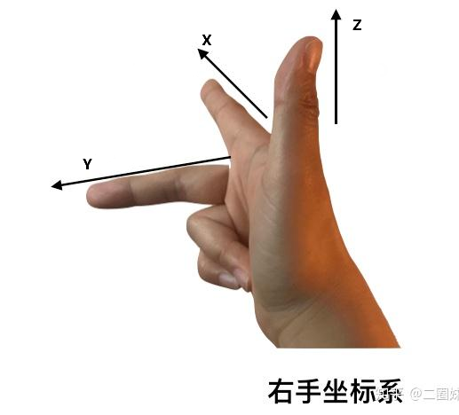

> P.S.里程计``Odometry``  
> 自瞄中，里程计是陀螺仪（电控），将上电位置作为世界坐标系原点


### (2) 坐标系之间的欧式变换
- 刚体欧式变换 

    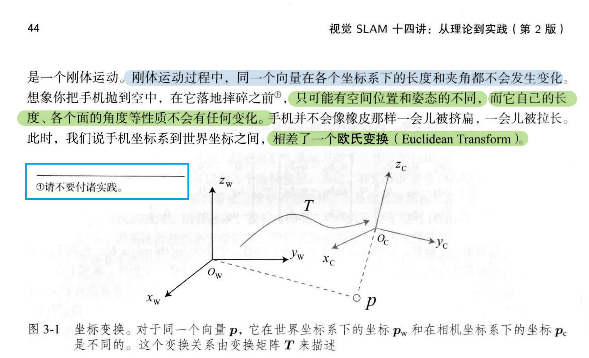

- 旋转矩阵``R`` : ``Rotation Matrix``  

    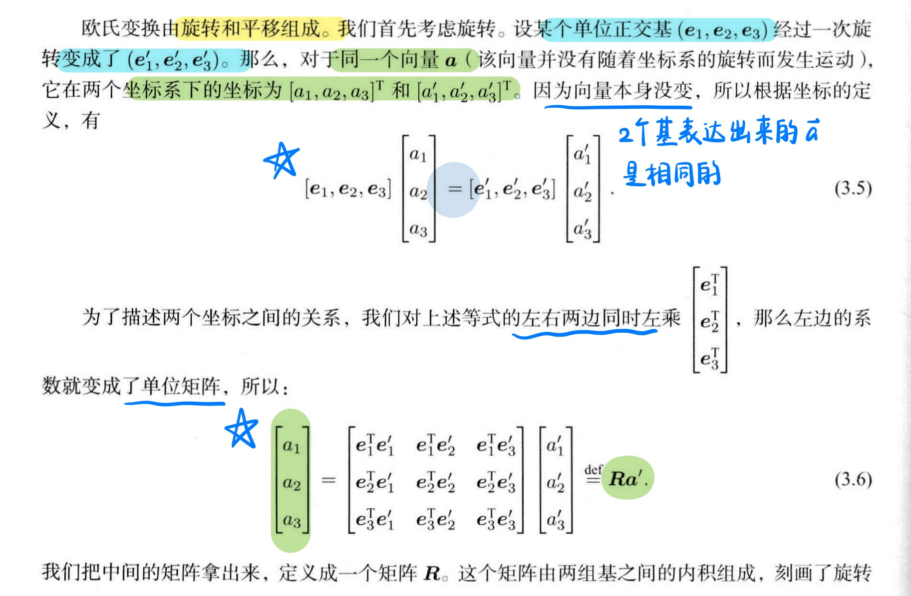

- 平移向量``t`` : ``Translation Vector``
    - $\mathbf{t} = \begin{bmatrix} t_x \\ t_y \\ t_z \end{bmatrix}$

### (3) 变换矩阵与齐次坐标
$
\mathbf{p}'_{\text{h}} = R \cdot \mathbf{p}_{\text{h}} + \mathbf{t}
$

令 $T = \begin{bmatrix}
R & \mathbf{t} \\
\mathbf{0}^\top & 1
\end{bmatrix}$

$\mathbf{p}'_{\text{h}} = T \cdot \mathbf{p}_{\text{h}} = 
\begin{bmatrix}
R & \mathbf{t} \\
\mathbf{0}^\top & 1
\end{bmatrix}
\begin{bmatrix}
x \\
y \\
z \\
1
\end{bmatrix}$

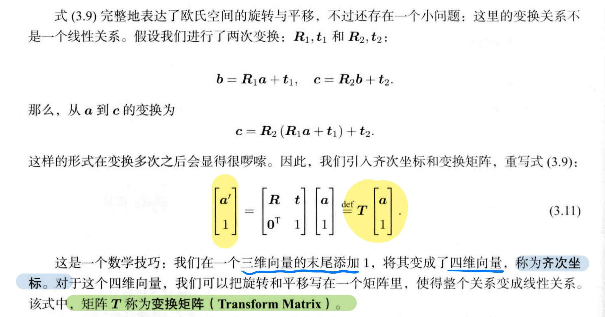
---

## 2.位姿

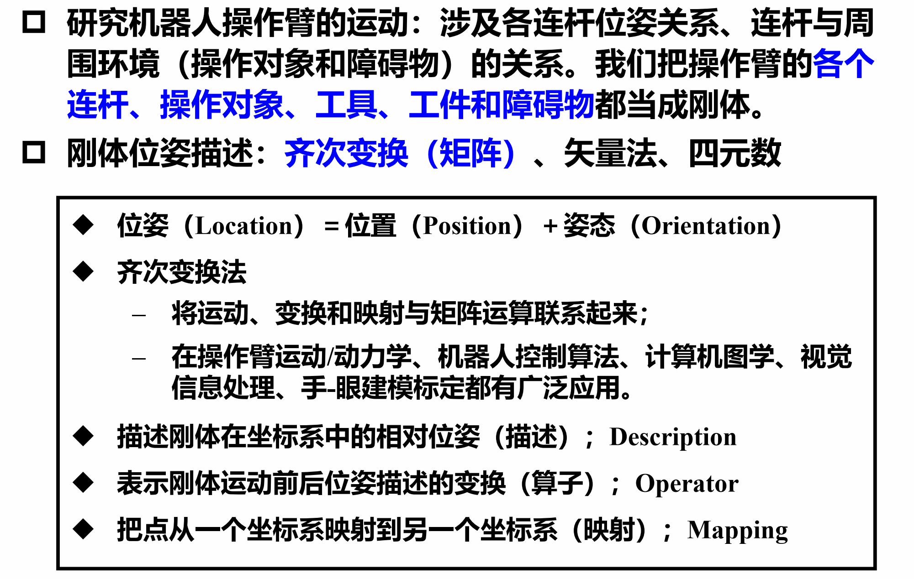

- [Pose官方消息类型](https://docs.ros.org/en/noetic/api/geometry_msgs/html/msg/Pose.html)  


位姿=位置+姿态
pose = position + orientation  
``geometry_msgs/Pose`` 

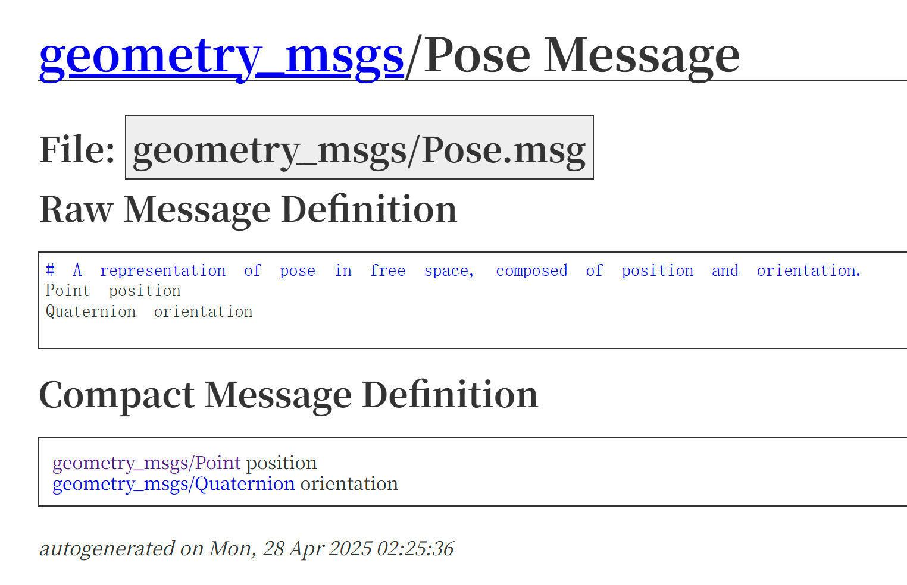

### (1) 位置的描述方法
``geometry_msgs/Point``  
```(x,y,z)```  

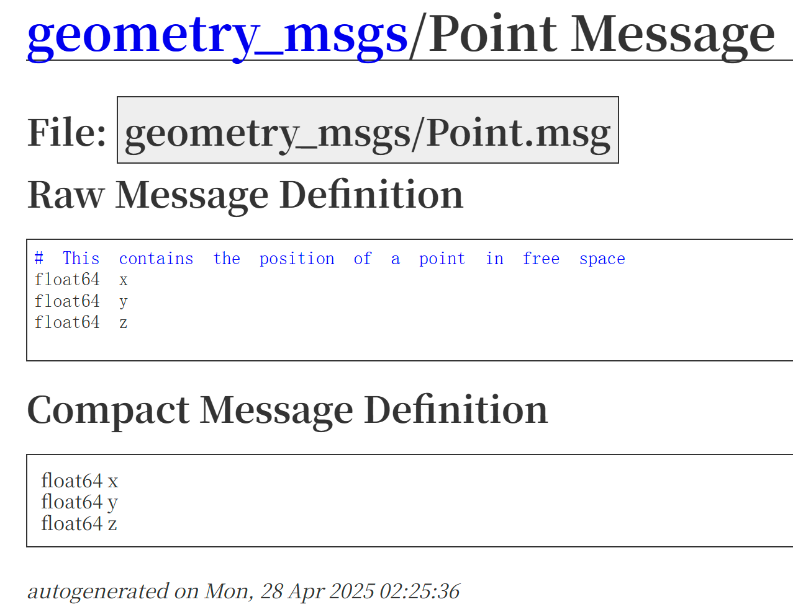

### (2) 姿态的描述方法

#### a. 欧拉角
- roll pitch yaw  
    * `r`（roll）：绕 **X 轴**
    * `p`（pitch）：绕 **Y 轴**
    * `y`（yaw）：绕 **Z 轴**

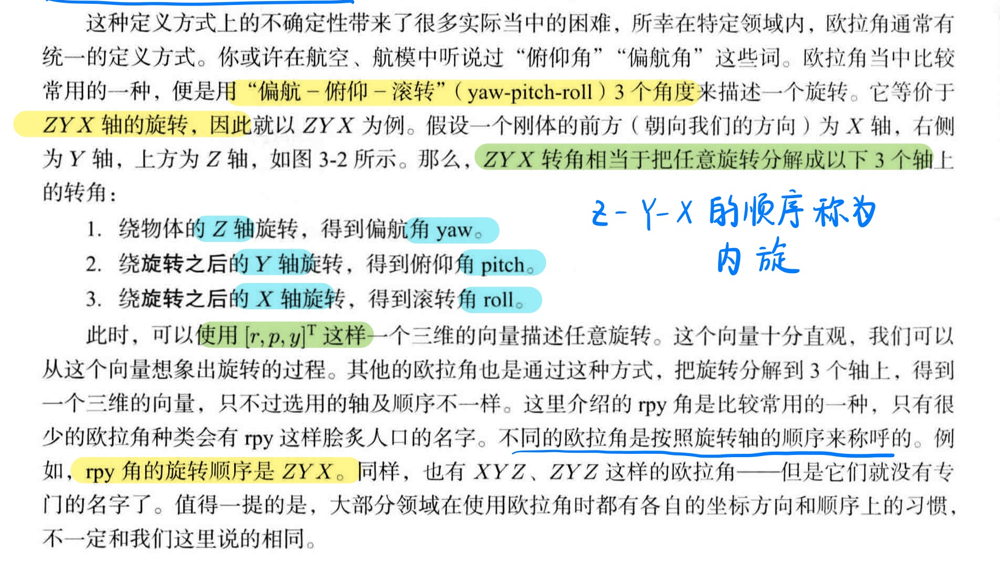
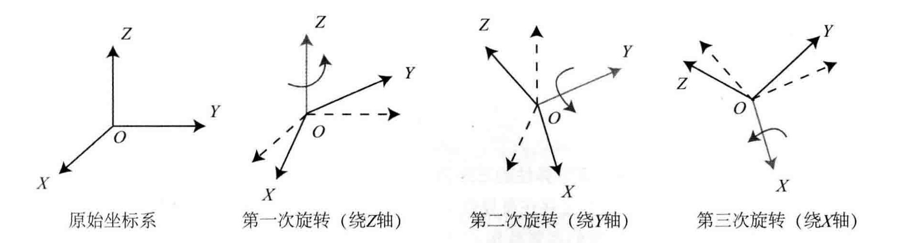

>注意：在机器人学和 ROS 中，**`roll → pitch → yaw` 表示的是旋转顺序，**  
> **但旋转矩阵是按 `ZYX` 顺序构造的**，因为旋转矩阵R矩阵是**右乘**，执行时是**从右到左**

> $ \mathbf{p}'_{\text{h}} = R \cdot \mathbf{p}_{\text{h}} + \mathbf{t} $   
> 
> $ R = R_x(\text{roll}) \cdot R_y(\text{pitch}) \cdot R_z(\text{yaw}) $

- 万向锁

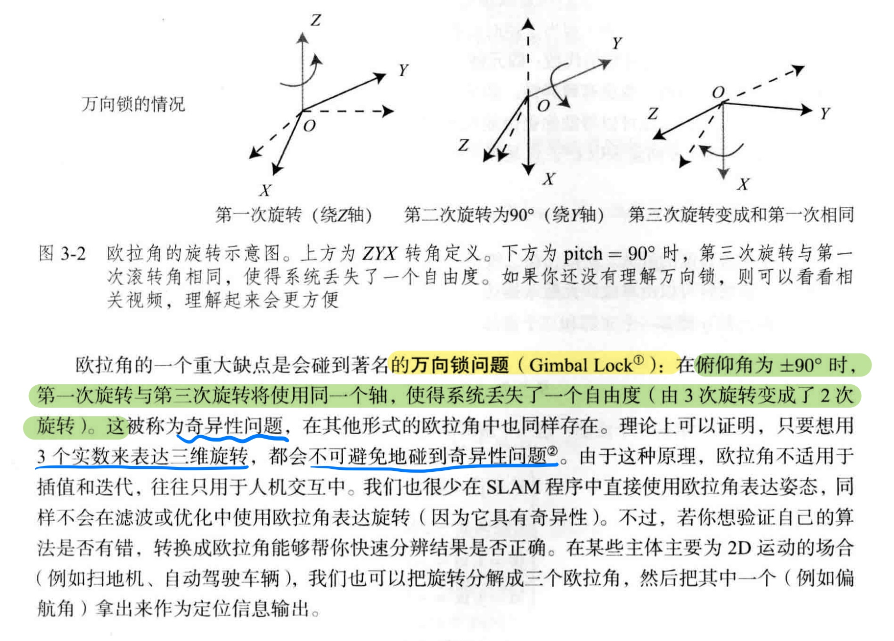


#### b. 轴角
物体绕指定轴、旋转指定角度

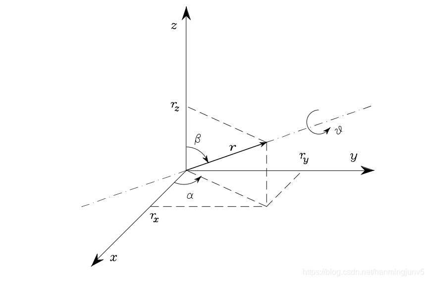
- Axis  
    - 旋转轴用单位向量表示
    - $\mathbf{u} = \begin{bmatrix} x \\ y \\ z \end{bmatrix}$

- Angle
    - 弧度制``rad``


#### c. 四元数
四元数   $Q = q_{0}  + q_{1} \vec{i} + q_{2} \vec{j} + q_{3} \vec{k} $  

- [四元数可视化](https://www.bilibili.com/video/BV1SW411y7W1?vd_source=7f8884af7fd7d142a4a56a0e52735937)
- [四元数的欧拉公式](https://www.bilibili.com/video/BV12N411U7yE?vd_source=7f8884af7fd7d142a4a56a0e52735937)

``geometry_msgs/Quaternion``  
``(x,y,z,w)`` 注意``(x,y,z)``是虚部，``w``是实部

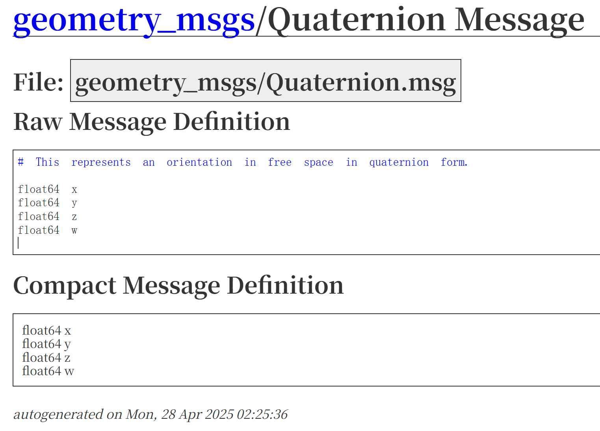

常见四元数：
| 旋转轴         | 旋转角度 | 四元数 (x, y, z, w)                                   | 说明           |
| ----------- | ---- | -------------------------------------------------- | ------------ |
| 无旋转         | 0°   | (0, 0, 0, 1)                                       | 单位四元数        |
| 绕 X 轴旋转 90° | 90°  | ($\frac{\sqrt{2}}{2}$, 0, 0, $\frac{\sqrt{2}}{2}$) | 右手绕 X 轴旋转90° |
| 绕 Y 轴旋转 90° | 90°  | (0, $\frac{\sqrt{2}}{2}$, 0, $\frac{\sqrt{2}}{2}$) | 右手绕 Y 轴旋转90° |
| 绕 Z 轴旋转 90° | 90°  | (0, 0, $\frac{\sqrt{2}}{2}$, $\frac{\sqrt{2}}{2}$) | 右手绕 Z 轴旋转90° |


### (3) 总结Pose
```C++
    // 创建 Pose 消息对象
    geometry_msgs::msg::Pose pose_msg;

    // === 1. 设置位置 position ===
    pose_msg.position.x = 1.0;
    pose_msg.position.y = 2.0;
    pose_msg.position.z = 0.5;

    // === 2. 设置姿态 orientation（四元数）===
    pose_msg.orientation.x = 0.0;
    pose_msg.orientation.y = 0.0;
    pose_msg.orientation.z = 0.0;
    pose_msg.orientation.w = 1.0;  // 单位四元数，对应无旋转
```


