# 相机模型  

## 0.推荐参考资料

《视觉slam十四讲》pdf页码120（书上是集成度很高的公式，本文档主要是详细拆解）  
- [华科狼牙培训视频](https://www.bilibili.com/video/BV1Uc411Z7B9?vd_source=7f8884af7fd7d142a4a56a0e52735937)    
- [【ROS】相机内参标定](https://www.bilibili.com/video/BV1Fe4y1z725?vd_source=7f8884af7fd7d142a4a56a0e52735937)

## 1.引入
### Q1：相机标定是什么？
使用标定板（指定方格大小）来算出相机的一些相关参数 (即内参和外参)  
这些参数只与焦距、透镜有关，焦距调整后必须重新标定  

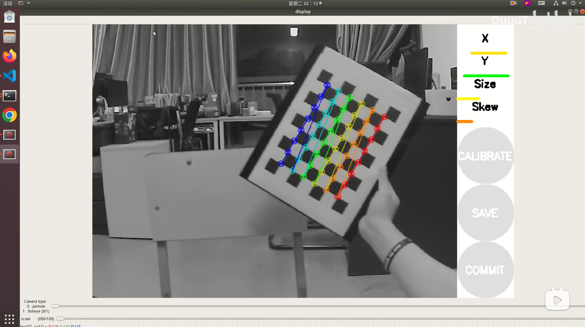
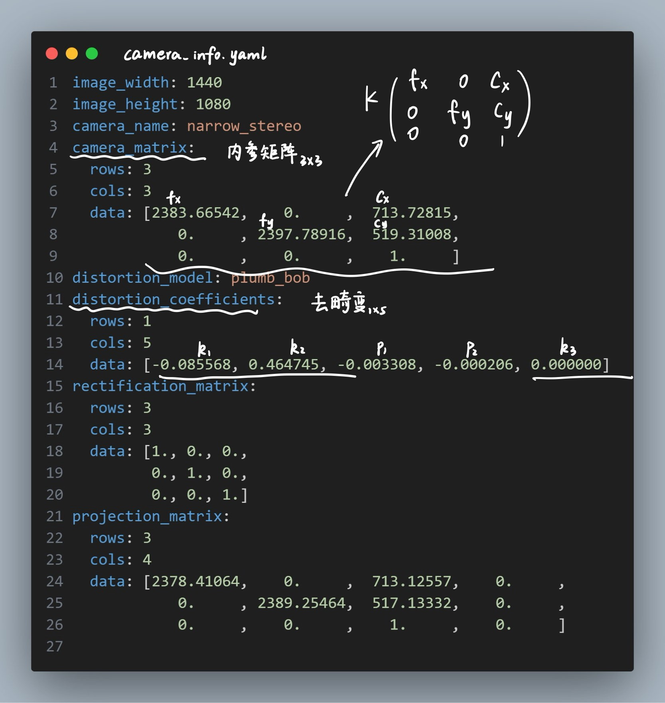

### Q2：为什么需要相机标定
内参外参是未知的确定量，只能用一定方法算  

### Q3：几何建模和标定计算的逻辑关系
几何建模是正向推导（Pw → Puv），  
但实际标定是逆向估计（已知 Puv、Pw → 求解 K -- 张正友标定法）

## 2.认识相机模型  

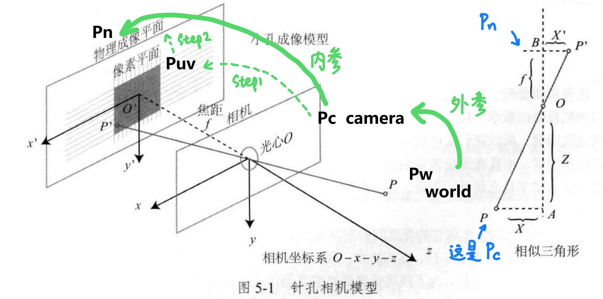

- 世界坐标系：**$\mathbf{P}_w$**
- 相机坐标系：**$\mathbf{P}_c$**
- 归一化平面坐标：**$\mathbf{p}_n$**
- 像素坐标：**$\mathbf{p}_{uv}$**
  
| 名称     | 内容             | 来源          | 单位            | 作用          |
| ------ | -------------- | ----------- | ------------- | ----------- |
| 内参 K   | 焦距 + 主点 + 像素变换 | 相机内参标定      | 像素        | 相机坐标 → 像素坐标 |
| 外参 R,t | 相机在世界坐标中的姿态    | 相机外参标定（PnP） | R 无量纲，t 单位 mm | 世界坐标 → 相机坐标 |

## 3.几何建模推导

$
\mathbf{P}_w
\xrightarrow{[R|t]}
\mathbf{P}_c
\xrightarrow{K}
\mathbf{P}_{uv}
$

### (1)外参：世界坐标系Pw --> 相机坐标系Pc  
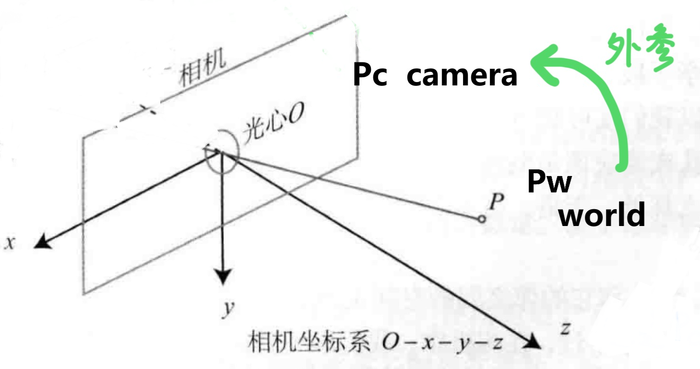

第一步是坐标变换，在Pw和Pc两种坐标系下，描述同一个点P  

$ \mathbf{P}_c = R \mathbf{P}_w + \mathbf{t} \ $

### (2)内参：相机坐标系Pc --> 像素坐标系Puv

#### Step1：相机坐标系Pc --> 成像平面坐标Pn
- 如果有畸变先处理畸变   
- 小孔成像-相似三角形  

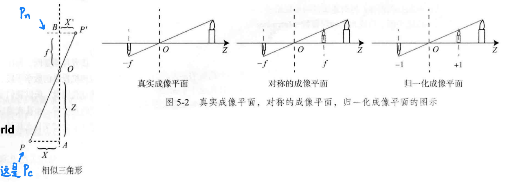
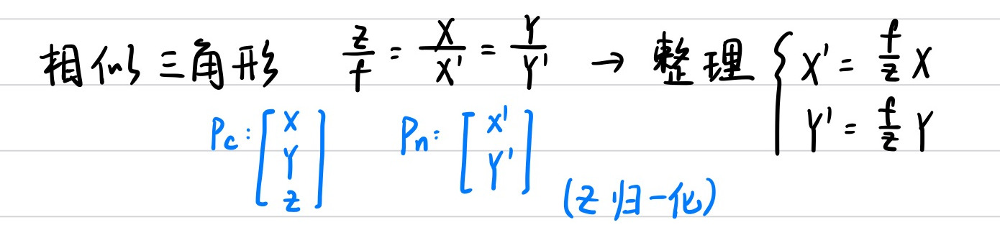

#### Step2：成像平面Pn --> 像素坐标Puv
成像平面坐标和像素坐标，存在原点的平移和放缩  

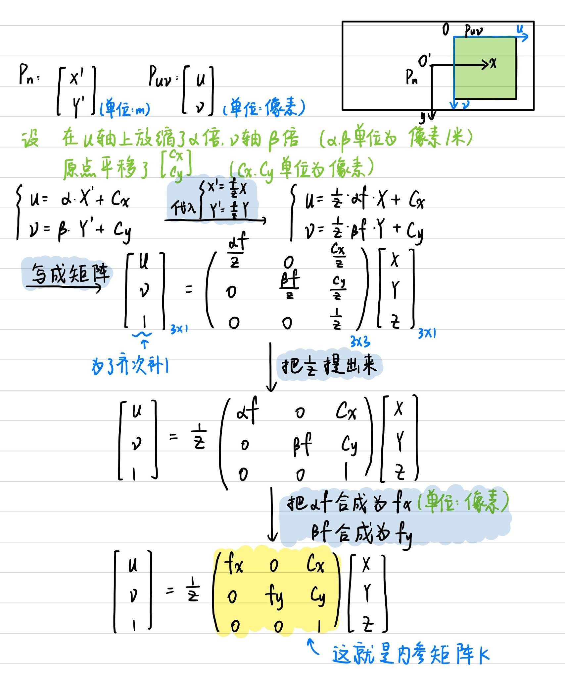  

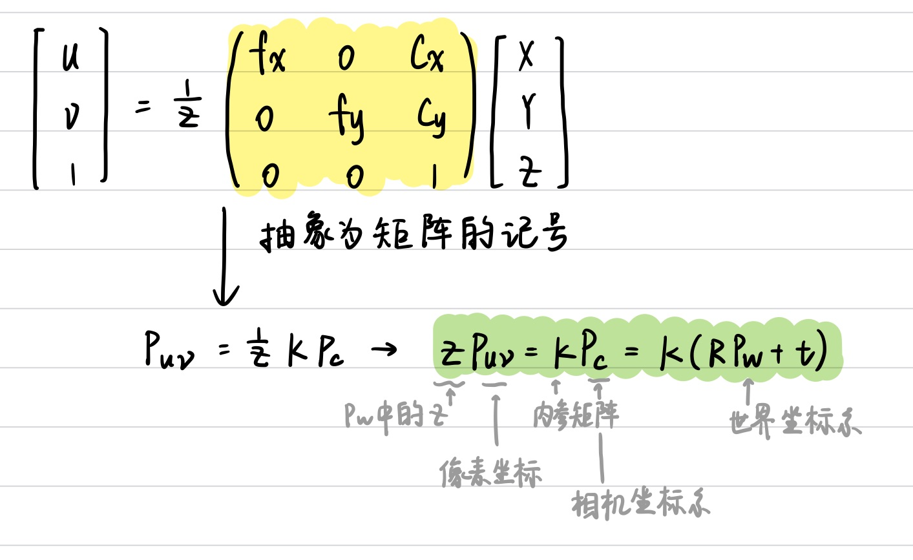

| 属性   | 成像平面坐标 $(X', Y')$ | 像素坐标 $(u, v)$     |
| ---- | ----------------- | ----------------- |
| 所在平面 | 相机的成像平面（传感器面）     | 图像网格（显示/图文件）      |
| 单位   | 毫米（mm）、米（m）       | 像素（px）            |
| 坐标系统 | 物理连续坐标系           | 整数格点坐标系           |
| 原点位置 | 通常在中心             | 通常在左上角（OpenCV 默认） |
| 转换关系 | 通过焦距和像素密度转换       | 由相机内参矩阵 K 转换      |

## 4.畸变  

畸变分为径向畸变和切向畸变

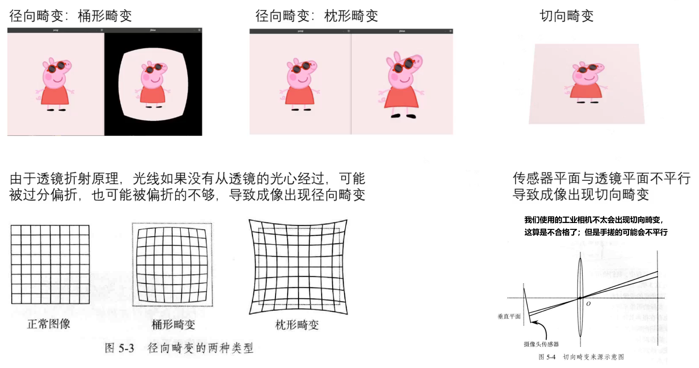

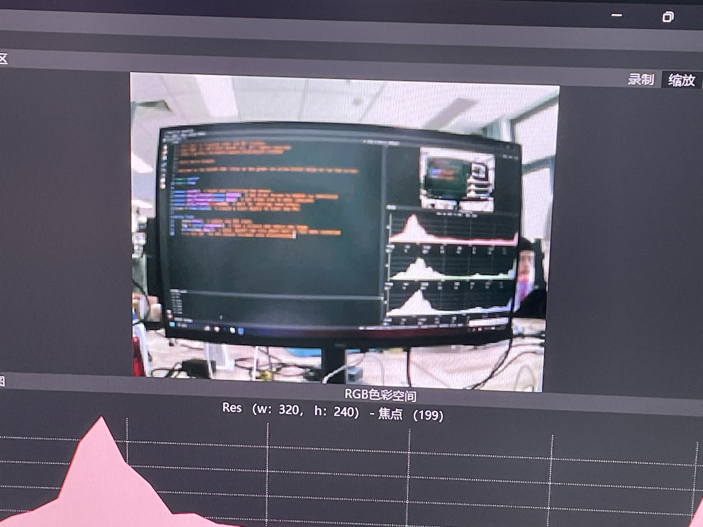

解决方法：多项式进行修正  

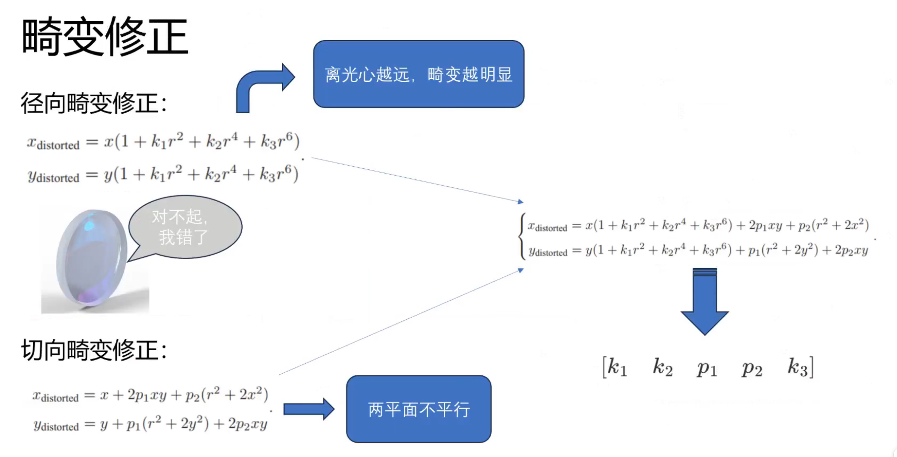

径向畸变修正：k1,k2,k3
切向畸变修正：p1,p2

## 5.标定计算流程

### (1)计算流程  
- 标定计算和前面的几何建模是反着的，标定中已知量是Puv和Pw，待求量是K、R、t  
- 求解方法：最小化重投影误差 (了解即可)  

    - 解释：  
        > **重投影误差**是：
        > 相机模型（由 $K, R, t$ 决定）**计算出的像素点位置** 和 **实际图像中观测到的位置** 之间的差异。

    - 直观理解：  
        > 有一个三维点 $\mathbf{P}_w$，
        用当前估计的 $K, R, t$ 把它投影到图像上，得到一个“预测像素点” $(u', v')$。
        但图像中实际看到它的像素位置是 $(u, v)$

        > 那么：   
        > 重投影误差 = $ \sqrt{(u - u')^2 + (v - v')^2} $

    - 最小化过程做了什么？

        > 有很多张图像、很多角点，每个点都有一个误差
        
        > 把所有这些误差加起来，形成总误差：  
            $ \sum_{i=1}^{N} \left\| \mathbf{P}_{uv}^{(i)} - \hat{\mathbf{P}}_{uv}^{(i)} \right\|^2 $  
            其中 $\hat{\mathbf{P}}_{uv}^{(i)}$ 是计算出来的像素位置，
            $\mathbf{P}_{uv}^{(i)}$ 是图像中观测到的位置
        
        > 然后通过优化算法（通常是非线性最小二乘）来反复调整 $K, R, t$，
        使总误差最小

    - 举例   
        比如用棋盘格标定相机，图像上识别出某个角点的像素坐标是 $(213, 456)$，
        而根据当前估计的 $K, R, t$ 投影出来的位置是 $(210, 459)$，
        那么这个点的重投影误差就是：
        $
        \sqrt{(213 - 210)^2 + (456 - 459)^2} = \sqrt{9 + 9} = \sqrt{18}
        $

于是，标定操作中要把各自由度发挥到最大，要有各个姿态的照片，迭代效果才会好

### (2)操作  

根据标神的标定部署文档 （见群文件  “自瞄部署和调试.pdf”）  
官方文档：https://docs.nav2.org/tutorials/docs/camera_calibration.html

#### 注意事项：
**①官方标定文档中修改：
所有``<ros2-distro>``改为humble**   
新指令如下（一行开一个新终端）

``sudo apt install ros-humble-camera-calibration-parsers  ``   

``sudo apt install ros-humble-camera-info-manager   ``  

``sudo apt install ros-humble-launch-testing-ament-cmake ``

``git clone -b humble git@github.com:ros-perception/image_pipeline.git   ``

**②标定文档原代码：**  

7x9是棋盘格内定点（数格子是8x10，但是命令行传参要求的是内定点）  
0.02是每个格子的边长，单位m  

``ros2 run camera_calibration cameracalibrator --size 7x9 --square 0.02 --ros-args -r image:=/my_camera/image_raw -p camera:=/my_camera``

**我们运行时要修改为：**
``ros2 run camera_calibration cameracalibrator --size 7x9 --square 0.02 --ros-args -r image:=/image_raw -p camera:=/camera_info  ``
>第一处改动是删命名空间/my_camera   
第二处是改话题名，第二个/my_camera改为/camera_info   
最后一个话题名具体是/camera_info还是/my_info,请使用``ros2 topic list``看到底是哪个名字

**③相机参数复制修改**
caliberation的压缩包在tmp,找到tmp文件夹的方法是：  
>Home图标，右键，点show in files，会进到Computer/Home，点回Computer，找到tmp文件夹

将caliberation压缩包直接点开，找到.yaml文件，全选复制，接下来改rm_aim中的文件，如下两处需要修改  
>rm_aim/src/rm_vision/rm_vision_bringup/config/camera_info.yaml  （这是bringup的修改）   
>rm_aim/src/ros2-hik-camera/config/camera_info.yaml  (这是海康相机文件的修改)   

复制进去  
其实改bringup的就够了，但是最好还是两个都改  
记得``save ->colcon build ``

### (3)标定计算结果

