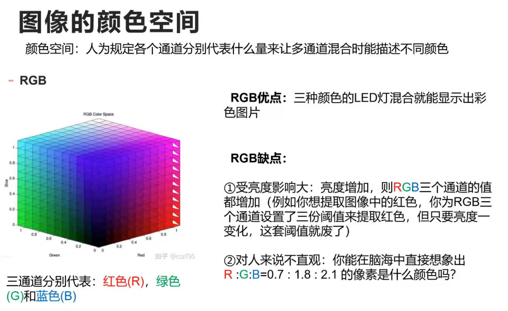
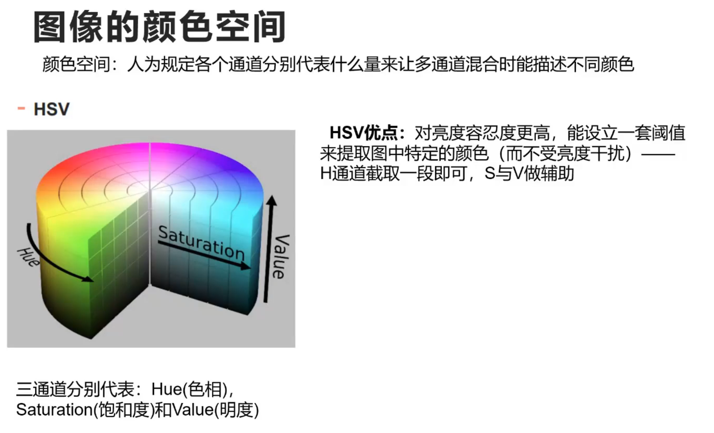
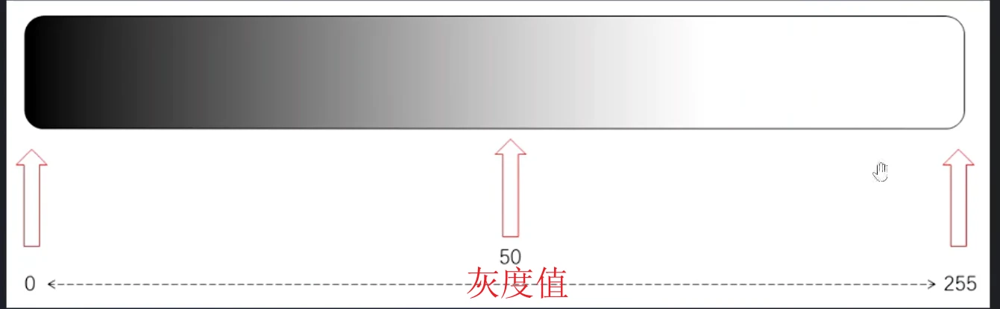
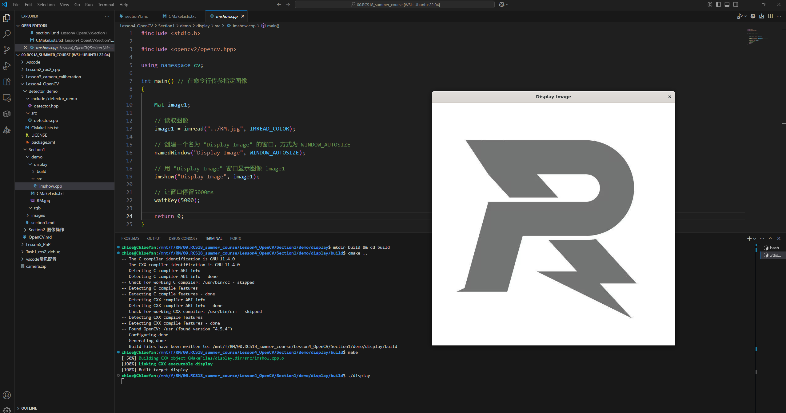
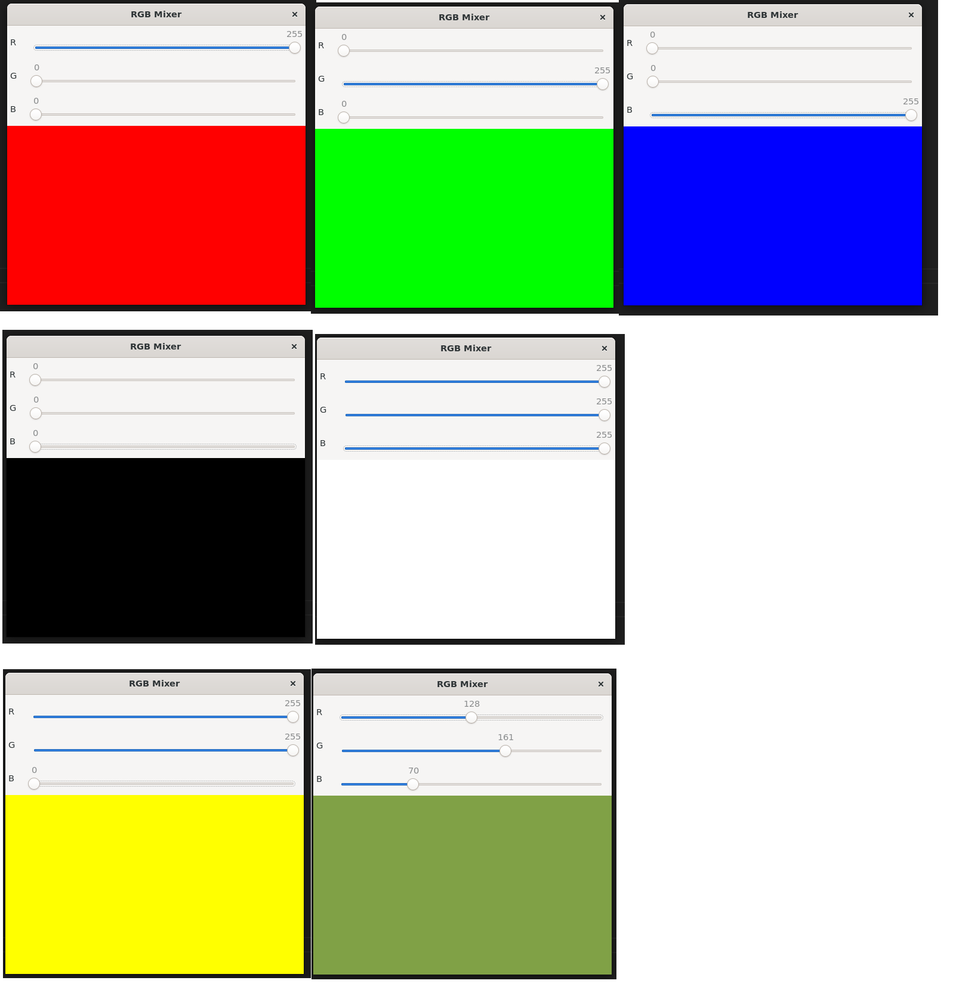

# OpenCV导论  

## I.OpenCV简介


## II.配置OpenCV开发环境
```bash
# 理论上使用小鱼安装工具 ros-humble-desktop 已经有下载了libopencv
# 以下指令检查OpenCV版本
pkg-config --modversion opencv4
```
如果输出``4.5.4``之类的版本号，就是可以了

```bash
# 如果没有装 pkg-config 那么就安装
sudo apt install pkg-config
```

```bash
# 可以再确认一下头文件的路径
ls /usr/include/opencv4/opencv2
```


## III.数字图像处理基础知识

### 1.基础概念
【『Robomaster视觉组』OpenCV入门级讲解】https://www.bilibili.com/video/BV1uT4y1q7aa?vd_source=7f8884af7fd7d142a4a56a0e52735937   (02:29-19:39)

TODO RGB三通道、HSV、像素几乘几、灰度值





### 2.demo体验
先看效果，再看代码

#### (1) 显示图像
```cpp
#include <stdio.h>

#include <opencv2/opencv.hpp>

using namespace cv;

int main() // 在命令行传参指定图像
{

    Mat image1;

    // 读取图像
    image1 = imread("../RM.jpg", 1); // 1-RGB  0-gray

    // 创建一个名为 "Display Image" 的窗口，方式为 WINDOW_AUTOSIZE
    namedWindow("Display Image", WINDOW_AUTOSIZE);

    // 用 "Display Image" 窗口显示图像 image1
    imshow("Display Image", image1);

    waitKey(0);

    return 0;
}
```
```cmake
cmake_minimum_required(VERSION 3.22)
project(display) # project name

find_package( OpenCV REQUIRED ) # 找到OpenCV依赖

include_directories( ${OpenCV_INCLUDE_DIRS} ) # 添加OpenCV include目录

add_executable( display src/imshow.cpp ) # 可执行文件

target_link_libraries( display ${OpenCV_LIBS} ) # 链接
```




#### (2) RGB Trackbar混色
```cpp
#include <opencv2/opencv.hpp>

using namespace cv;

int r = 0, g = 0, b = 0;

void on_trackbar(int, void *)
{
    // 创建一个纯色图像（300x500）
    Mat color(300, 500, CV_8UC3, Scalar(b, g, r));
    imshow("RGB Mixer", color);
}

int main()
{
    // 创建窗口
    namedWindow("RGB Mixer", WINDOW_AUTOSIZE);

    // 创建滑动条
    createTrackbar("R", "RGB Mixer", &r, 255, on_trackbar);
    createTrackbar("G", "RGB Mixer", &g, 255, on_trackbar);
    createTrackbar("B", "RGB Mixer", &b, 255, on_trackbar);

    // 初始显示一次
    on_trackbar(0, 0);

    // 等待退出（按 ESC 键）
    while (true)
    {
        int key = waitKey(10);
        if (key == 27)
            break; // ESC
    }

    destroyAllWindows();
    return 0;
}
```
```cmake
cmake_minimum_required(VERSION 3.10)
project(rgb)

find_package(OpenCV REQUIRED)
include_directories(${OpenCV_INCLUDE_DIRS})

add_executable(rgb src/trackbar.cpp)
target_link_libraries(rgb ${OpenCV_LIBS})
```




