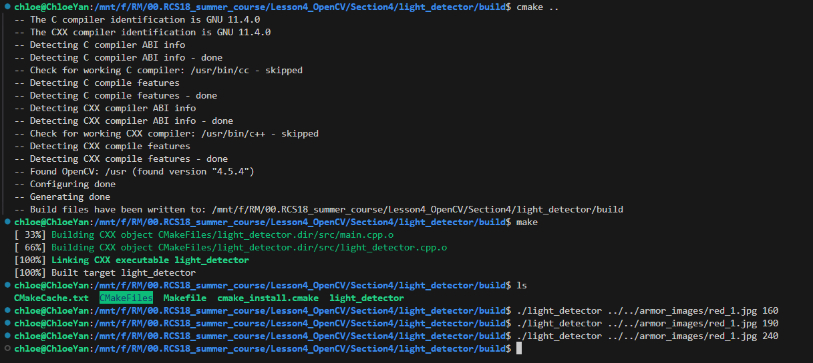

# OpenCV中的图像处理

## 0.命令行传参

```bash
./demo_threshold ../../armor_images/blue_2.jpg 50
#   可执行文件        图像路径                  阈值
```


## 1.图像阈值

- 简单阈值处理

这种阈值处理的方法是简单易懂的。如果像素值大于阈值，则为其分配一个值（可以是白色），否则为其分配另一个值（可以是黑色）。使用的函数是cv::threshold。函数第一个参数是源图像，它应该是灰度图像。第三个参数是用于对像素值进行分类的阈值。第四个参数是maxVal，它表示如果像素值大于（有时小于）阈值则要给出的值。OpenCV提供不同类型的阈值，由函数的第五个参数决定。
```cpp
double cv::threshold(
    InputArray src,         // 输入图像
    OutputArray dst,        // 输出图像
    double thresh,          // 阈值
    double maxval,          // 最大值
    int type                // 阈值类型
);	
```
```C++
void cv::cvtColor(
    InputArray src,        // 输入图像（通常为三通道BGR图像或单通道灰度图）
    OutputArray dst,       // 输出图像（颜色空间转换后的图像）
    int code,              // 颜色空间转换的代码（如 COLOR_BGR2GRAY）
    int dstCn = 0          // 输出图像的通道数（默认0，表示根据 code 自动判断）
);
```

- 自适应阈值处理

在上面，我们使用全局值作为阈值，但在图像在不同区域具有不同照明条件的所有条件下可能并不好。在那种情况下，我们进行自适应阈值处理，算法计算图像的小区域的阈值，所以我们对同一幅图像的不同区域给出不同的阈值，这给我们在不同光照下的图像提供了更好的结果。
```cpp
void cv::adaptiveThreshold(
    InputArray src,         // 输入图像
    OutputArray dst,        // 输出图像
    double maxValue,        // 最大值
    int adaptiveMethod,     // 自适应方法 如ADAPTIVE_THRESH_MEAN_C、ADAPTIVE_THRESH_GAUSSIAN_C
    int thresholdType,      // 阈值类型 如cv::THRESH_BINARY、THRESH_BINARY_INV
    int blockSize,          // 邻域大小 必须奇数
    double C                // 常数 用于微调，通常取2-15
);
```
`adaptiveThreshold` 参数详解

| 参数名称          | 可选值/范围                  | 功能说明                                                                 | 使用技巧                                                                 |
|-------------------|-----------------------------|--------------------------------------------------------------------------|--------------------------------------------------------------------------|
| **adaptiveMethod** | `ADAPTIVE_THRESH_MEAN_C`     | 使用邻域均值作为阈值，计算速度快                                         | 适合光照渐变平缓的场景                                                   |
|                   | `ADAPTIVE_THRESH_GAUSSIAN_C` | 使用高斯加权邻域值，抗噪性更好                                           | 适合光照不均匀或噪声较多的图像                                           |
| **thresholdType**  | `THRESH_BINARY`             | 大于阈值设为maxValue，否则设为0（亮目标/暗背景）                         | 文档扫描、OCR预处理首选                                                  |
|                   | `THRESH_BINARY_INV`         | 大于阈值设为0，否则设为maxValue（暗目标/亮背景）                         | 工业检测（深色零件浅色背景）                                             |
| **blockSize**      | 奇整数 (≥3)                 | 决定计算阈值的邻域窗口大小                                               | 值越大适应光照变化范围越广（推荐11-35）                                   |
| **double C**       | 典型值 -10~+15              | 从阈值计算结果中减去的常数，用于微调灵敏度                               | 正值降低阈值（增加前景），负值提高阈值（增加背景）                        |


- Otsu's二值化

Otsu's 二值化是一种自动确定图像阈值的二值化方法，通过最大化类间方差来找到最佳阈值，使得背景和前景尽可能分开。它是一种自适应的阈值选择方法，不需要手动设定阈值。

Otsu's 方法通过最大化类间方差（即前景和背景的像素值差异）来自动选择最佳的阈值。这种方法假设图像包含两个类（前景和背景），并尝试找到一个阈值，将这两个类区分开来，使得每个类内的像素强度值尽可能的相似，而类间的像素强度差异最大。
```cpp
double otsuThresh = cv::threshold(
    src, dst, 0, 255, // 同上，但是初始阈值0在使用OTSU时无效
    cv::THRESH_BINARY | cv::THRESH_OTSU); // 组合标志
```

### Task
- [ ] 将一张rgb图像threshold二值化
> 提示：可以直接GRAYSCALE读，也可以COLOR读再调用cvtColor

- [ ] 将一张rgb图像 adaptiveThreshold二值化
> 要求，使用IMREAD_COLOR读取，使用cvtColor转成灰度图；  
> adaptiveThreshold 参数分别使用THRESH_BINARY、THRESH_BINARY_INV，展示这两个窗口


## 2.图像滤波

### (1) 卷积与卷积核

- [什么是卷积](https://www.bilibili.com/video/BV1Vd4y1e7pj?vd_source=7f8884af7fd7d142a4a56a0e52735937)


### (2) 三种常用滤波

- [官方文档](https://docs.opencv.org/4.x/d9/df8/tutorial_root.html)

- 图像模糊（图像平滑）

通过将图像与低通滤波器卷积核卷积来实现平滑图像。它有助于消除噪音，从图像中去除了高频内容（例如：噪声，边缘）。因此在此操作中边缘会模糊一点。（有的平滑技术也不会平滑边缘）。OpenCV主要提供四种平滑技术。
```cpp
// 均值模糊: 简单平均，计算速度快，但会模糊边缘。
void cv::blur(
    InputArray src,          // 输入图像
    OutputArray dst,         // 输出图像
    Size ksize,              // 内核大小
    Point anchor = Point(-1,-1), // 锚点位置，默认是内核中心
    int borderType = BORDER_DEFAULT // 默认参数：边界模式
);

// 高斯模糊: 权重中心的模糊，通常用来减少高斯噪声。
void cv::GaussianBlur(
    InputArray src,          // 输入图像
    OutputArray dst,         // 输出图像
    Size ksize,              // 内核大小
    double sigmaX,           // X 方向的标准差
    double sigmaY = 0,       // Y 方向的标准差，如果为 0 则 sigmaY = sigmaX
    int borderType = BORDER_DEFAULT // 默认参数：边界模式
);

// 中值模糊: 对椒盐噪声非常有效，保留边缘。
void cv::medianBlur(
    InputArray src,          // 输入图像
    OutputArray dst,         // 输出图像
    int ksize                // 内核大小，必须是奇数
);
```


## 3.轮廓

- [contours-官方文档](https://docs.opencv.org/4.x/df/d0d/tutorial_find_contours.html)

轮廓可以简单地解释为连接所有具有相同的颜色或强度的连续点（沿着边界）的曲线。轮廓是形状分析和物体检测和识别的很有用的工具。在OpenCV中，找到轮廓就像从黑色背景中找到白色物体。所以请记住，要找到的对象应该是白色，背景应该是黑色。为了更好的准确性，使用二进制图像，因此，在找到轮廓之前，应用阈值或canny边缘检测。
```cpp
/*
void cv::findContours(
    InputOutputArray image,    // 输入的二值图像，图像在检测过程中会被修改
    OutputArrayOfArrays contours, // 输出的轮廓，每个轮廓由一系列点组成
    OutputArray hierarchy,     // 可选的输出参数，轮廓的层次结构
    int mode,                  // 检测轮廓的模式
    int method,                // 轮廓的近似方法
    Point offset = Point()     // 轮廓点的偏移量
);
*/

// 检测轮廓
std::vector<std::vector<cv::Point>> contours; // 轮廓数组
std::vector<cv::Vec4i> hierarchy; //每个 Vec4i 存储一个轮廓的层次关系信息
cv::findContours(binary, contours, hierarchy, cv::RETR_TREE, cv::CHAIN_APPROX_SIMPLE);

// 绘制轮廓
cv::Mat drawing = cv::Mat::zeros(binary.size(), CV_8UC3);
for (size_t i = 0; i < contours.size(); i++) {
    cv::Scalar color = cv::Scalar(0, 255, 0); // 绿色
    cv::drawContours(drawing, contours, static_cast<int>(i), color, 2, 8, hierarchy, 0);
}
```

- 轮廓特征

轮廓特征是描述图像中检测到的轮廓的形状、大小、位置等属性的各种度量和描述。
```cpp
// 轮廓面积
double area = cv::contourArea(contours[i]);

// 轮廓周长
double perimeter = cv::arcLength(contours[i], true);

// 边界矩形
cv::Rect boundingBox = cv::boundingRect(contours[i]);   // 轴对齐矩形
cv::RotatedRect minRect = cv::minAreaRect(contours[i]); // 最小旋转矩形

// 最小外接圆
cv::Point2f center;
float radius;
cv::minEnclosingCircle(contours[i], center, radius);

// 最小外接椭圆（需要至少5个点）
if (contours[i].size() >= 5) {
    cv::RotatedRect minEllipse = cv::fitEllipse(contours[i]);
}

```


