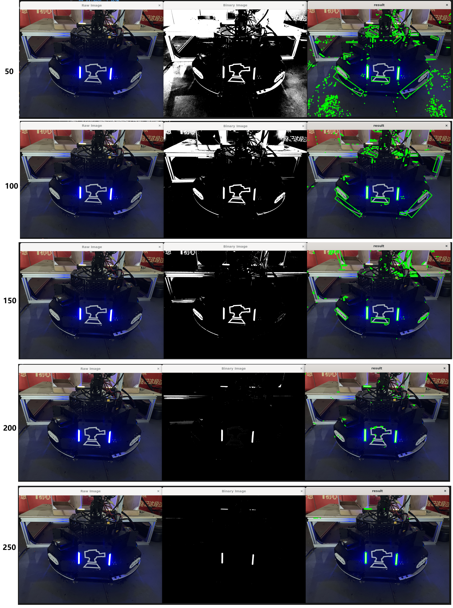

# 灯条识别

## I.基本功能：light_detector_1
1. 按照提供的main函数，在light_detector.cpp中完成函数实现  
函数声明已在hpp提供，请结合前3个section的知识，完成函数内容  


2. 调阈值  
编译完成后，命令行传参，传入`images_armor/noisy_background`中的图像地址




## II.进阶三：区分红蓝
实现方法：命令行传入敌方颜色，判断图像装甲板颜色是否匹配，匹配才能识别  
（经典永流传：【【RoboMaster2023-赛场回顾】英雄操作手被自家哨兵揍得叫妈妈】https://www.bilibili.com/video/BV1sm4y1b7hb?vd_source=7f8884af7fd7d142a4a56a0e52735937）（dbq提前磕头）

demo和I的操作方案都是第一步就转为灰度图，无法区分红蓝；以下两种方法将更精细的区分颜色

### 方法一：BGR通道差值法
遍历所有像素点，获取B、R通道的像素值总和
```C++
// 计算图像中红色和蓝色通道的总像素值
    long long sum_red = 0;
    long long sum_blue = 0;
```


## III.进阶四：利用ros2通讯机制
第2周
## IV.进阶五：yaml及动态调参
第2周
