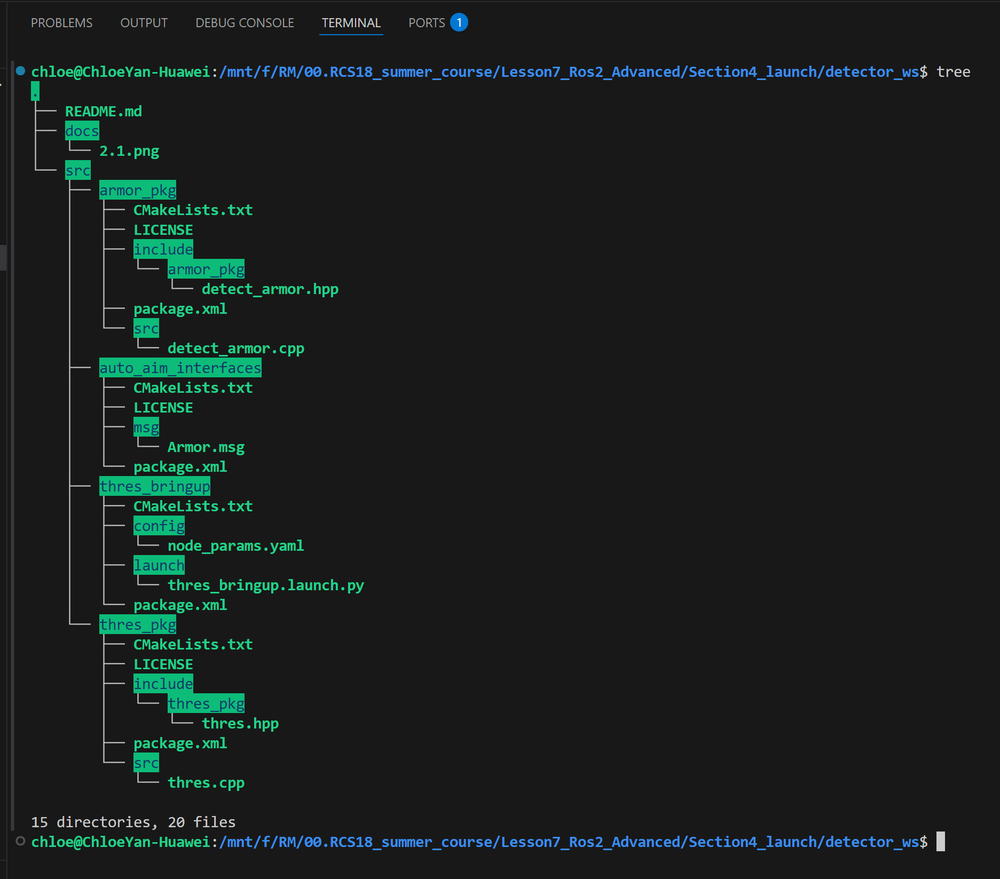
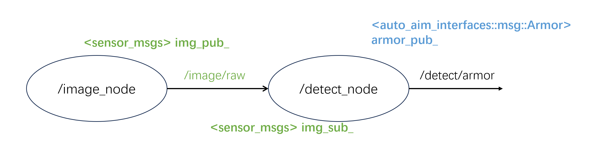

# detector_ws

## 1.ws结构
```tree
detector_ws
├── README.md
├── docs
│   ├── 1.1.png
│   └── 2.1.png
└── src
    ├── armor_pkg
    │   ├── CMakeLists.txt
    │   ├── LICENSE
    │   ├── include
    │   │   └── armor_pkg
    │   │       └── detect_armor.hpp
    │   ├── package.xml
    │   └── src
    │       └── detect_armor.cpp
    ├── auto_aim_interfaces
    │   ├── CMakeLists.txt
    │   ├── LICENSE
    │   ├── msg
    │   │   └── Armor.msg
    │   └── package.xml
    ├── thres_bringup
    │   ├── CMakeLists.txt
    │   ├── config
    │   │   └── node_params.yaml
    │   ├── launch
    │   │   └── thres_bringup.launch.py
    │   └── package.xml
    └── thres_pkg
        ├── CMakeLists.txt
        ├── LICENSE
        ├── include
        │   └── thres_pkg
        │       └── thres.hpp
        ├── package.xml
        └── src
            └── thres.cpp
```


## 2.通信结构



## 3.功能描述
由detect_armor节点接管之后，接入之前detector_demo的流程，只需要判断红蓝->如果合法则二值化并发布一段<auto_aim_interfaces>消息(数据自己编)。   

> 要求
>
> 1. 动态调参：阈值、红蓝(red-0 blue-1)   
> 2. 参数的初始值写在yaml，launch的时候从yaml读取初始值  
> 3. 使用components启动2个节点，不要main函数   
