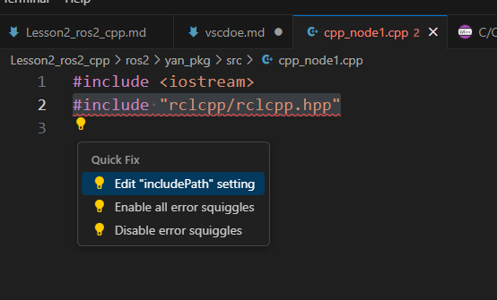
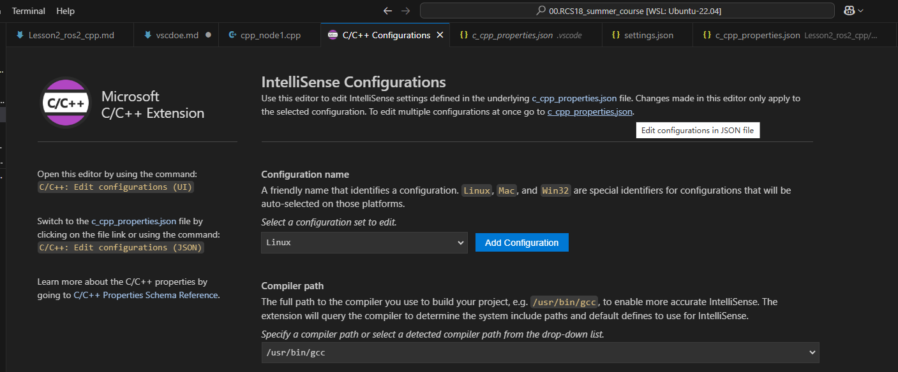
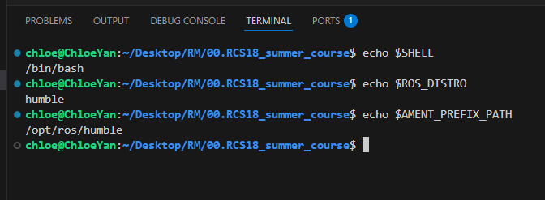

# vscode常见配置

## 1.include rclcpp 红线报错
本质上是vscode找不到，不影响编译  
如果看着不顺眼，可按照以下步骤解决
(1) 检查ros2
```bash
source /opt/ros/humble/setup.bash
```
(2) 点击灯泡，按照指引进入.vscode/c_cpp_properties.json  



然后全文替换为以下内容：  
（要是不放心的话，扔给ai帮你写）  
```json
{
    "configurations": [
        {
            "name": "Linux",
            "includePath": [
                "${workspaceFolder}/**",
                "/opt/ros/humble/include/**",
                "/usr/include/**",
                "/usr/local/include/**",
                "${workspaceFolder}/install/**",
                "${workspaceFolder}/build/**"
            ],
            "defines": [],
            "compilerPath": "/usr/bin/gcc",
            "cStandard": "c17",
            "cppStandard": "gnu++17",
            "intelliSenseMode": "linux-gcc-x64"
        }
    ],
    "version": 4
}
```
要是不放心的话，扔给ai帮你写


## 2.关于source的确认  
如果是用小鱼安装的ros2，那么小鱼已经帮我们把``source /opt/ros/humble/setup.bash``写进bashrc了。可按照一下方式检查  
(1) 检查Bash
```bash
echo $SHELL
```
如果输出是``/bin/bash``，那么就使用的是``Bash``，继续下面的步骤  

(2) 编辑``~/.bashrc``  
```bash
nano ~/.bashrc
```
看看文件中有没有，这就是小鱼帮我们写的
```bash
# >>> fishros initialize >>>
source /opt/ros/humble/setup.bash
# <<< fishros initialize <<<
```
如果想手动加，那么在文件最后添加
```bash
source /opt/ros/humble/setup.bash
```

(3) 验证是否生效
- 查看当前ros的版本
```bash
echo $ROS_DISTRO
```
如果输出``humble``，说明自动``source``成功  
- 查看AMENT_PREFIX_PATH环境变量值
```bash
echo $AMENT_PREFIX_PATH
```

